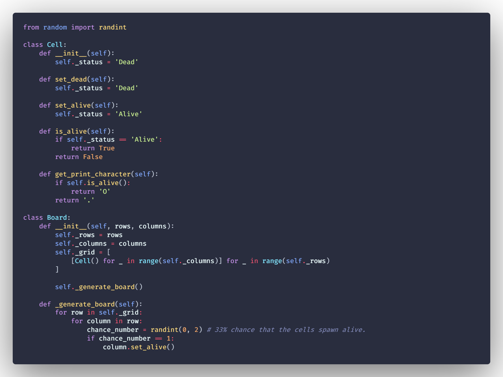
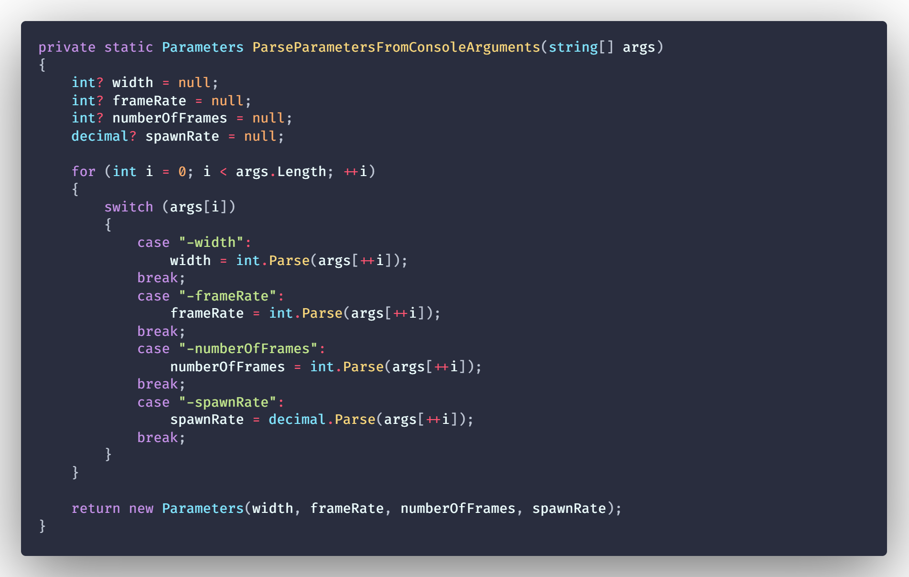
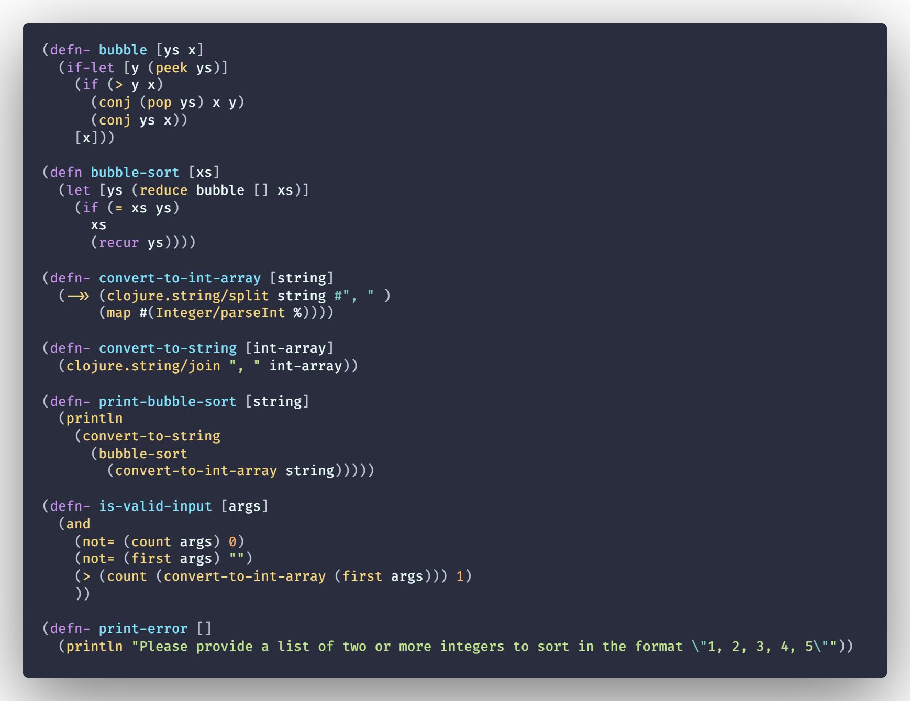
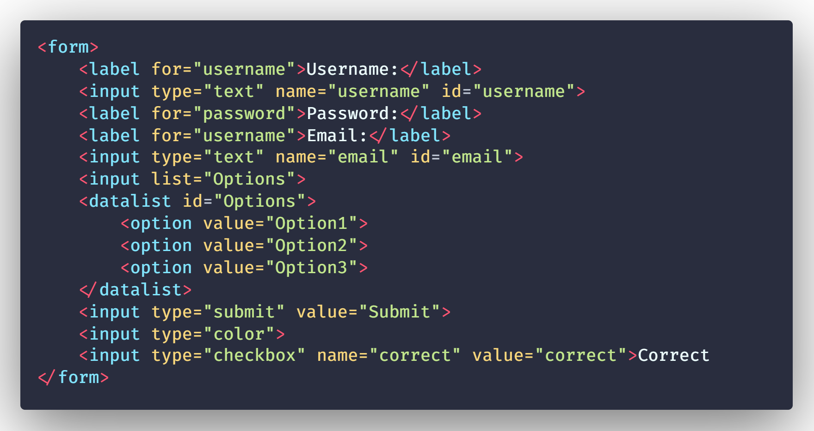
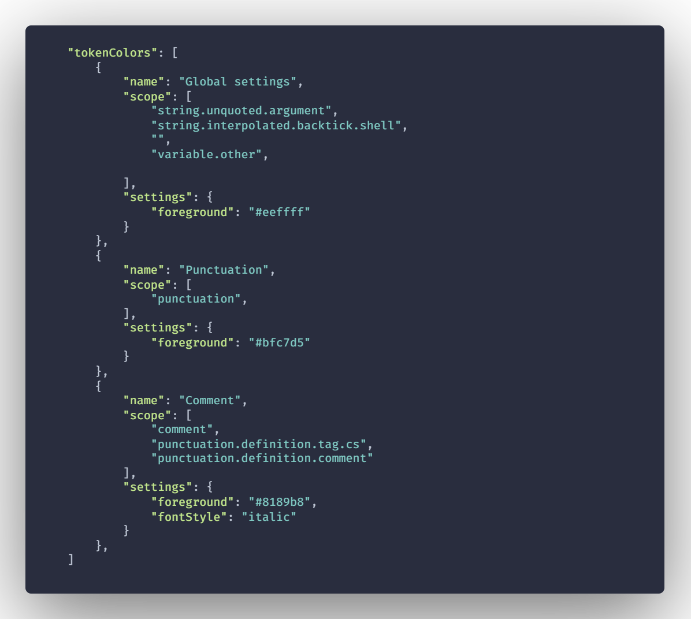
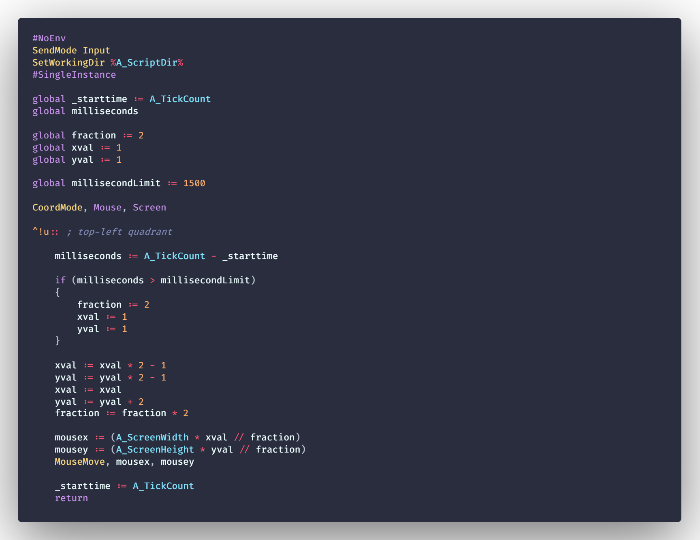

This is my personal theme that i've been using.
Based on the popular [Palenight Theme](https://marketplace.visualstudio.com/items?itemName=whizkydee.material-palenight-theme).

# Screenshots
Python:

C++:

C#:

Clojure:

HTML:

JSON:

AHK:

The font I am using in the screenshots is [Fira Code](https://github.com/tonsky/FiraCode).