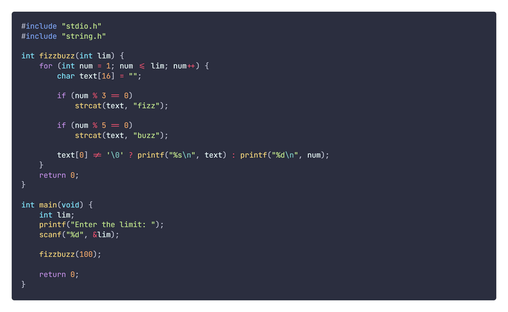
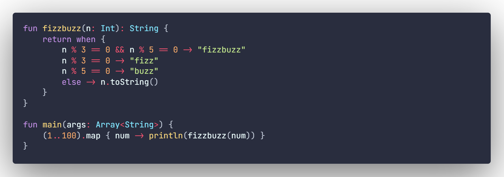
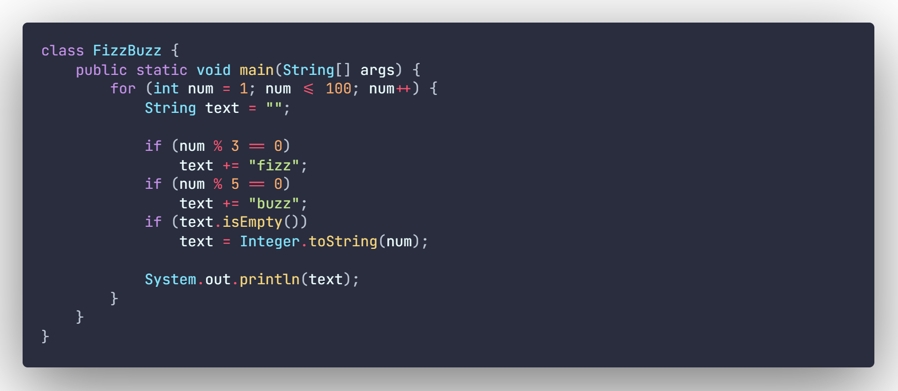
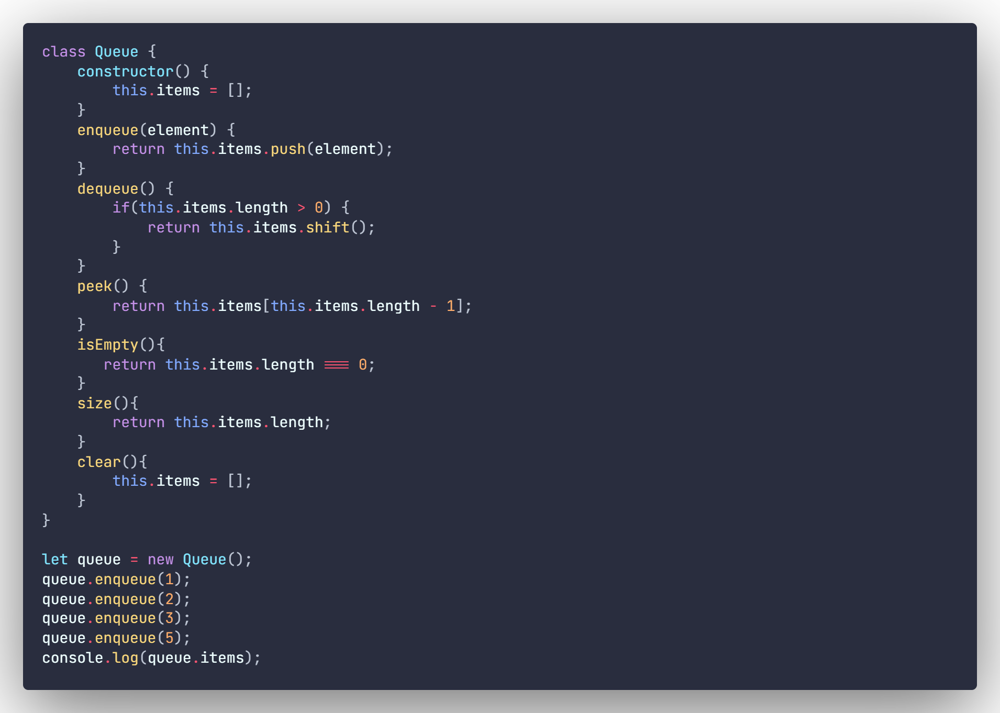
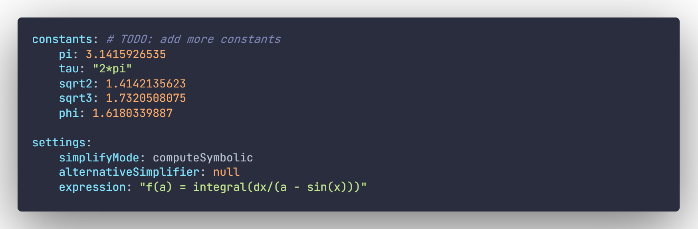
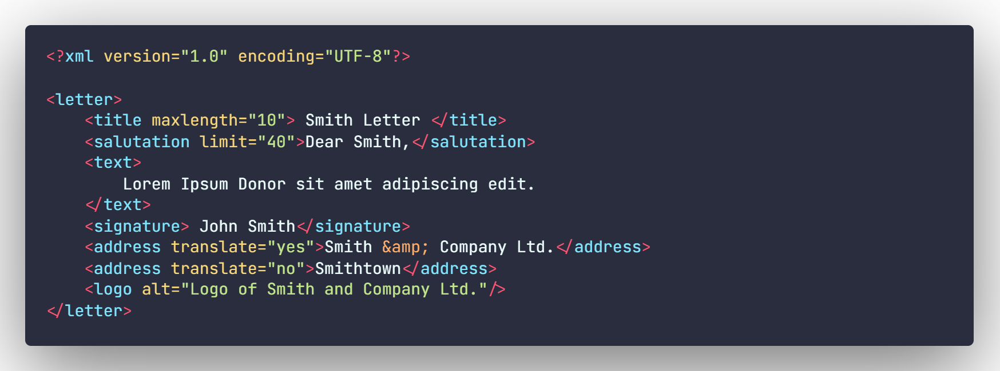
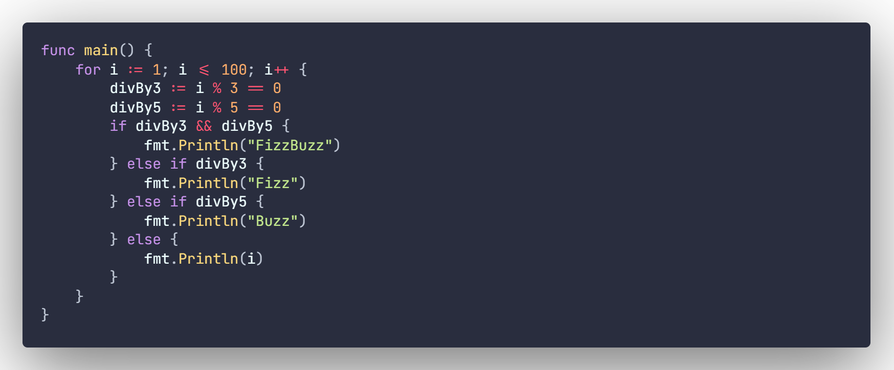
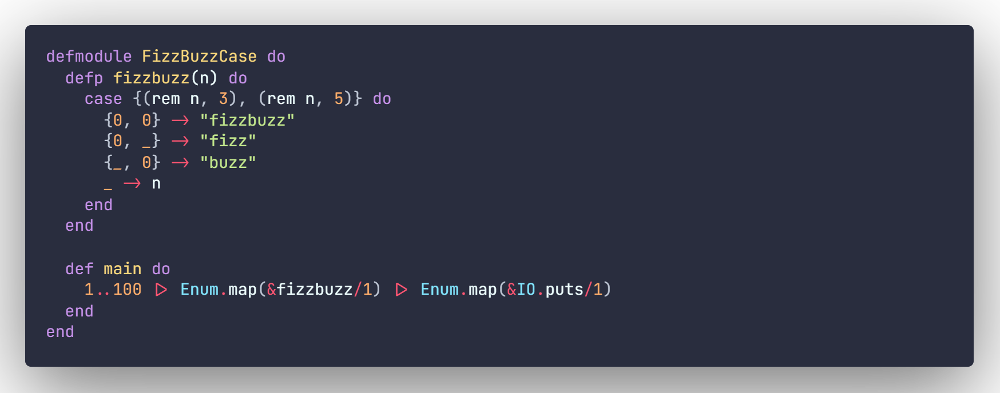

This is my personal theme that i've been using.
Based on the popular [Palenight Theme](https://marketplace.visualstudio.com/items?itemName=whizkydee.material-palenight-theme).

# Images:

## Python:

## C:

## C++:

## C#:

## Clojure:

## Kotlin:

## Java:

## JavaScript:

## HTML:

## CSS:

## JSON:

## YAML:

## XML:

## Go:

## Elixir:

## AHK:

The font I am using in the screenshots is [JetBrains Mono](https://www.jetbrains.com/lp/mono/).