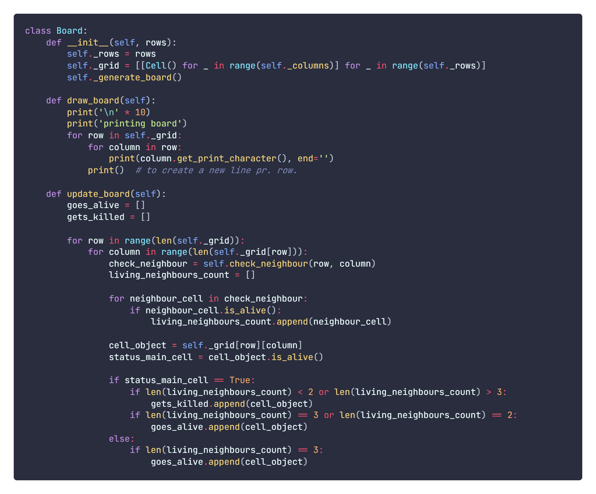
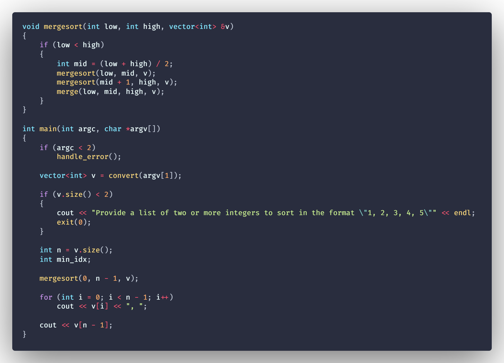
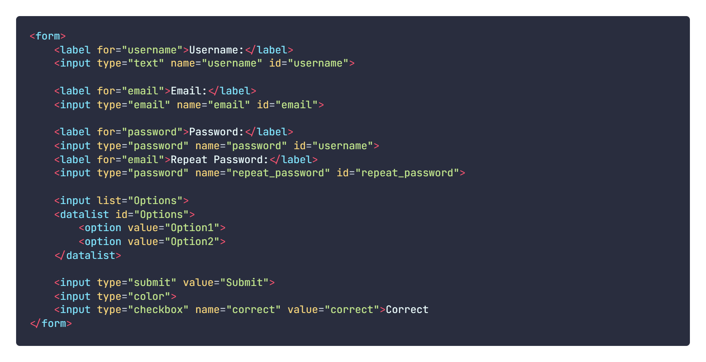
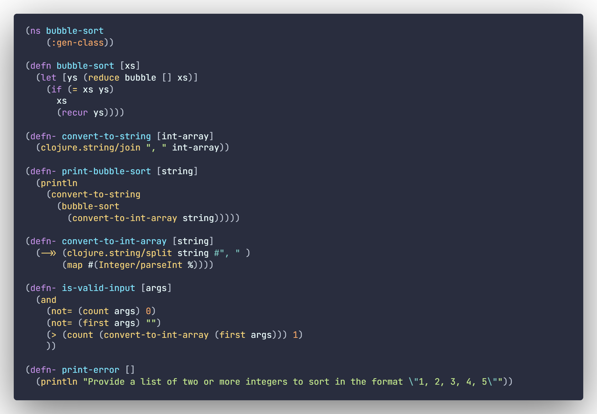
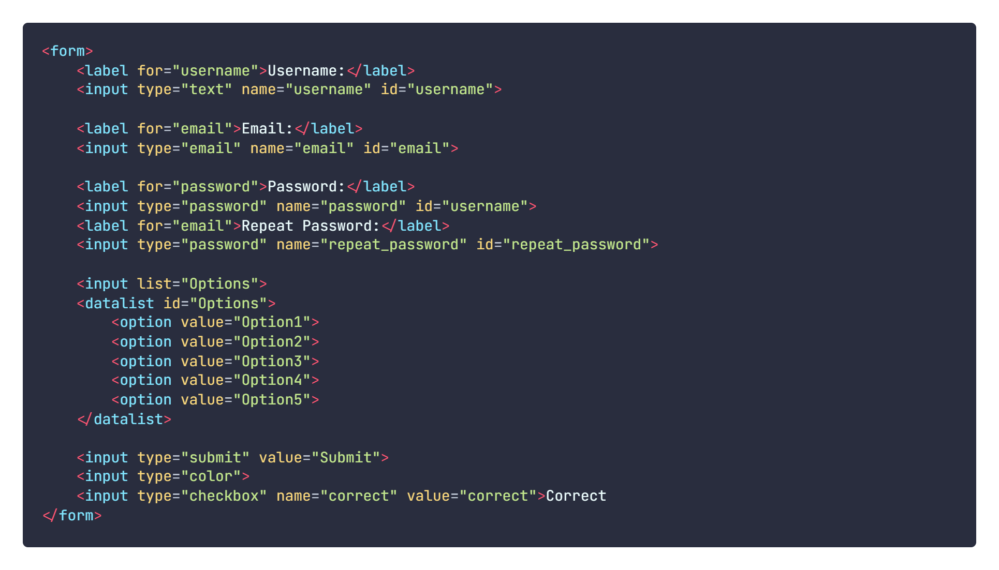
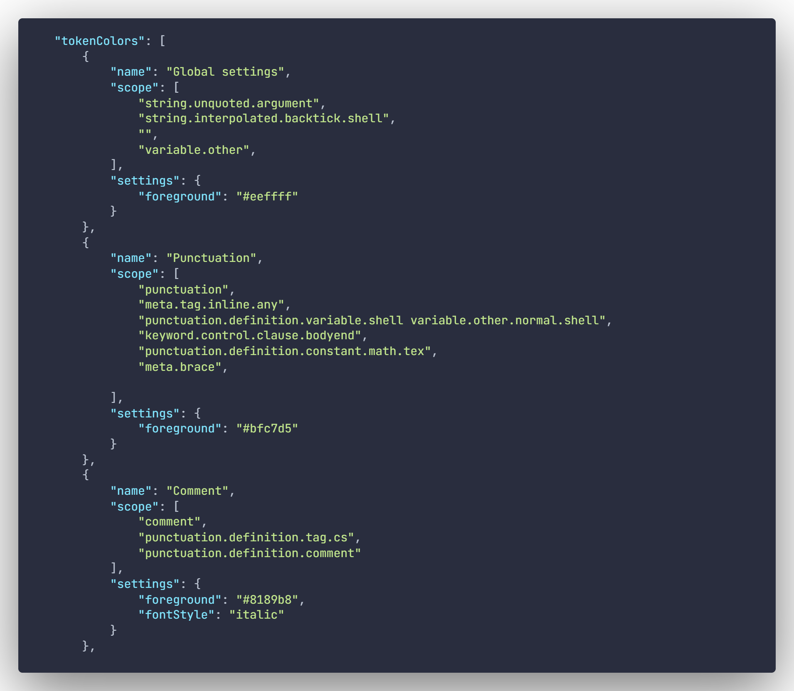
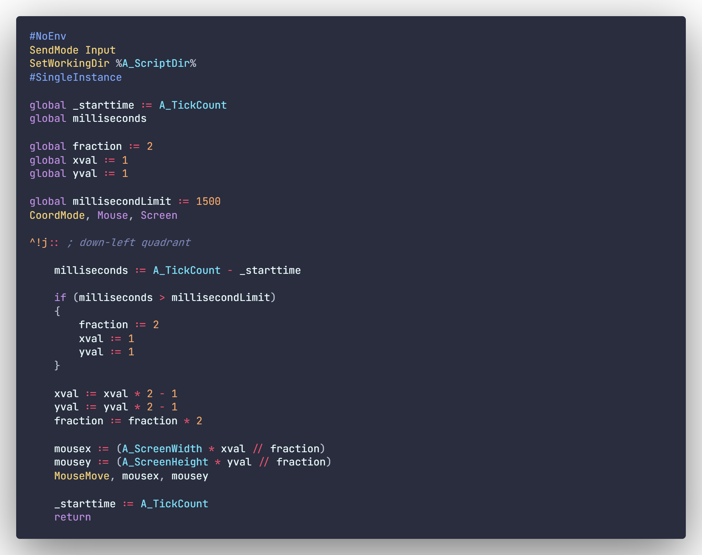

This is my personal theme that i've been using.
Based on the popular [Palenight Theme](https://marketplace.visualstudio.com/items?itemName=whizkydee.material-palenight-theme).

 Python:

 C++

 C#

 Clojure

 HTML

 JSON:

 AKH

 

The font I am using in the screenshots is [Fira Code](https://github.com/tonsky/FiraCode).