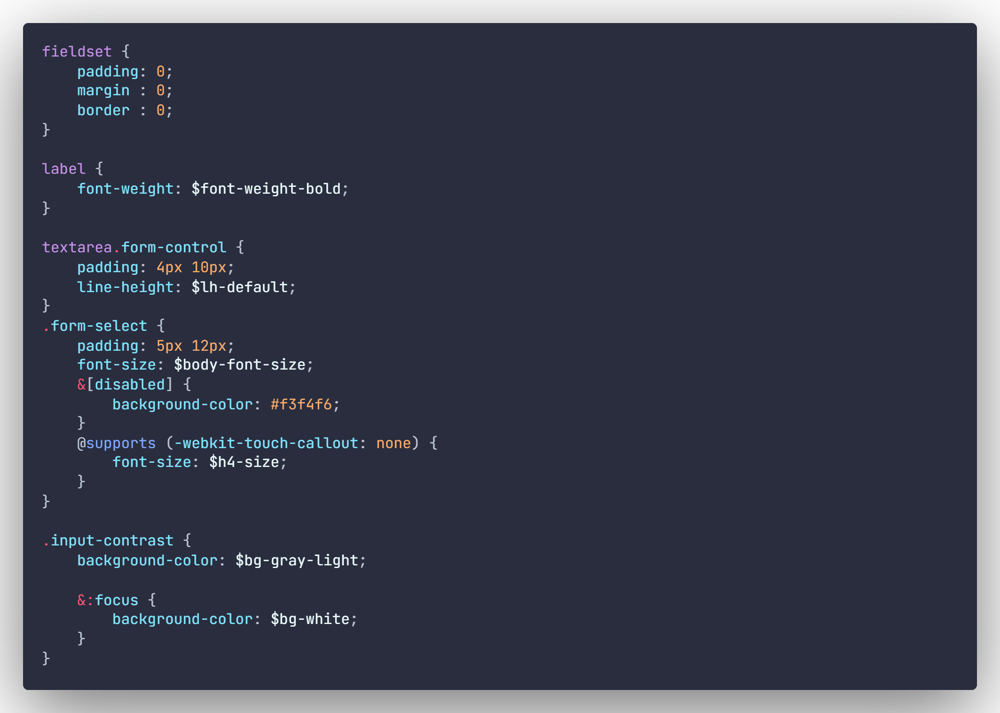

<h2>  Python: </h2>

<h2>  C++: </h2>

<h2>  C#: </h2>

<h2> Clojure: </h2>

<h2> HTML: </h2>

<h2> SCSS: </h2>

<h2>  JSON: </h2>

<h2>  Elixir: </h2>

The font I am using in the screenshots is [JetBrains Mono](https://www.jetbrains.com/lp/mono/).